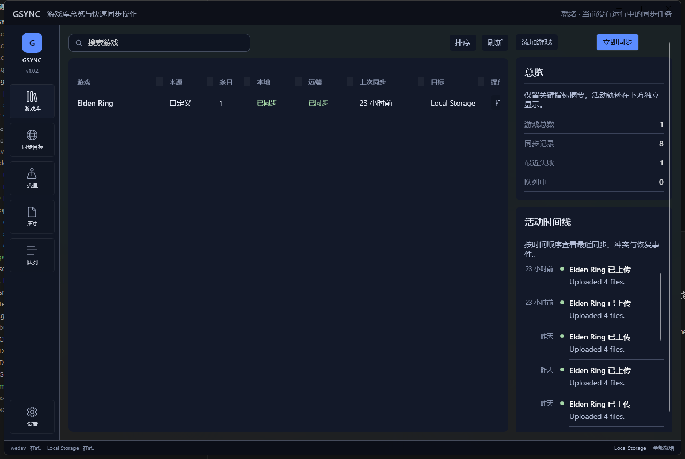
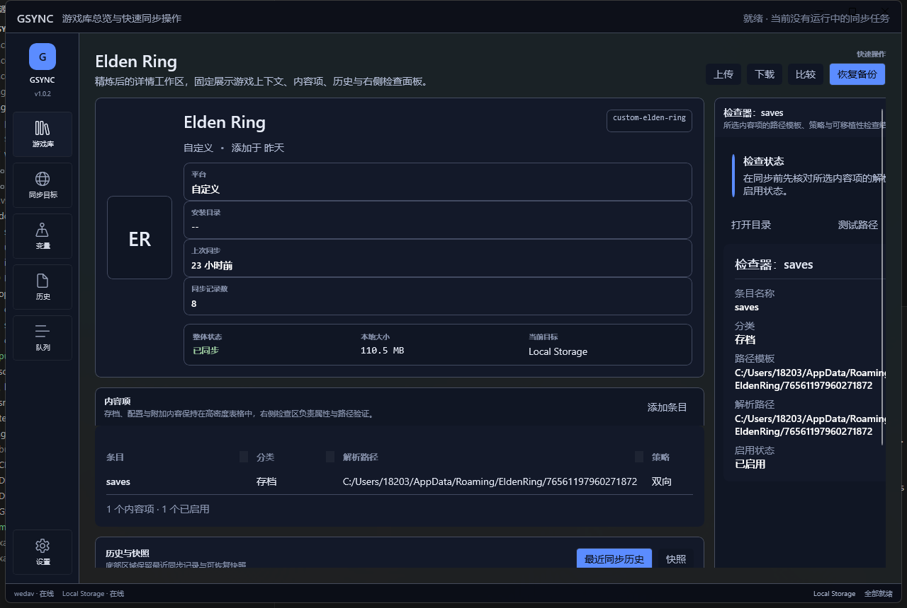
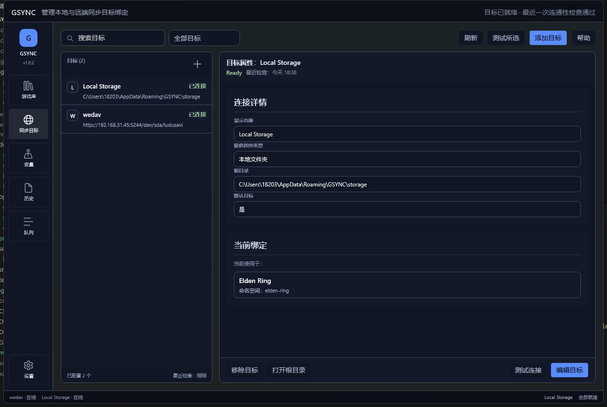
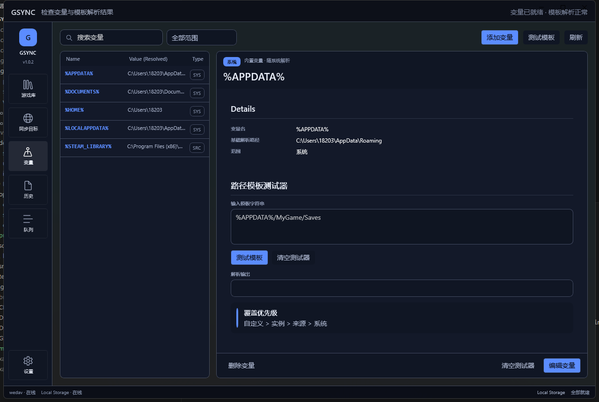
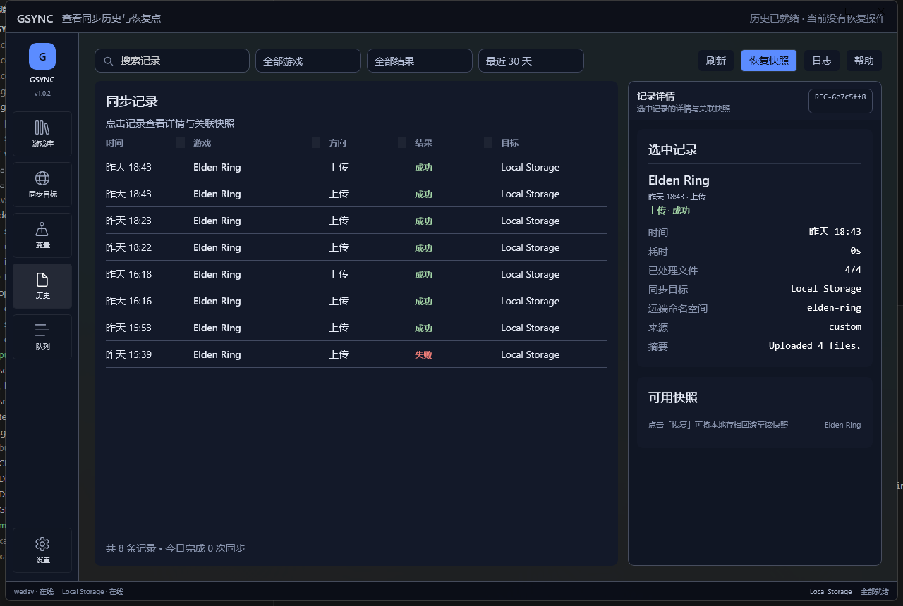
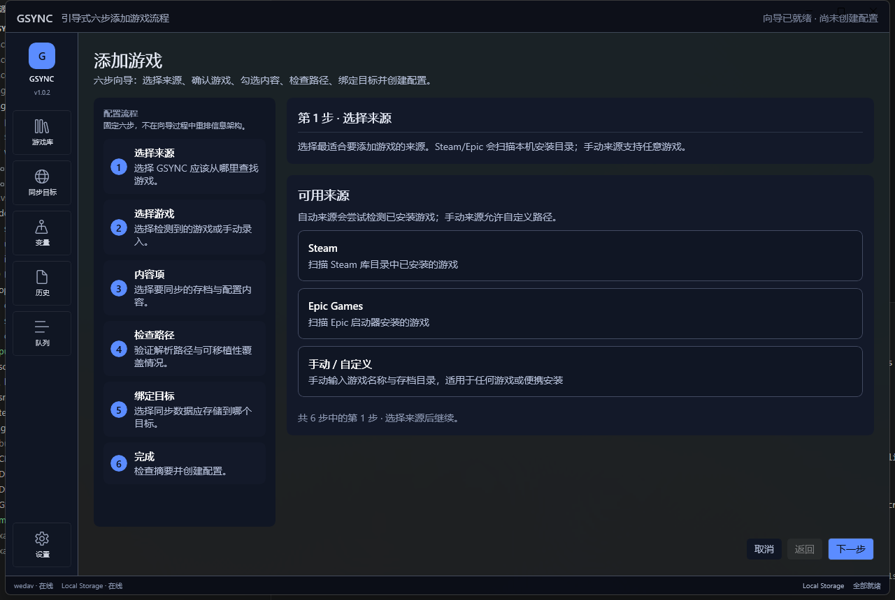
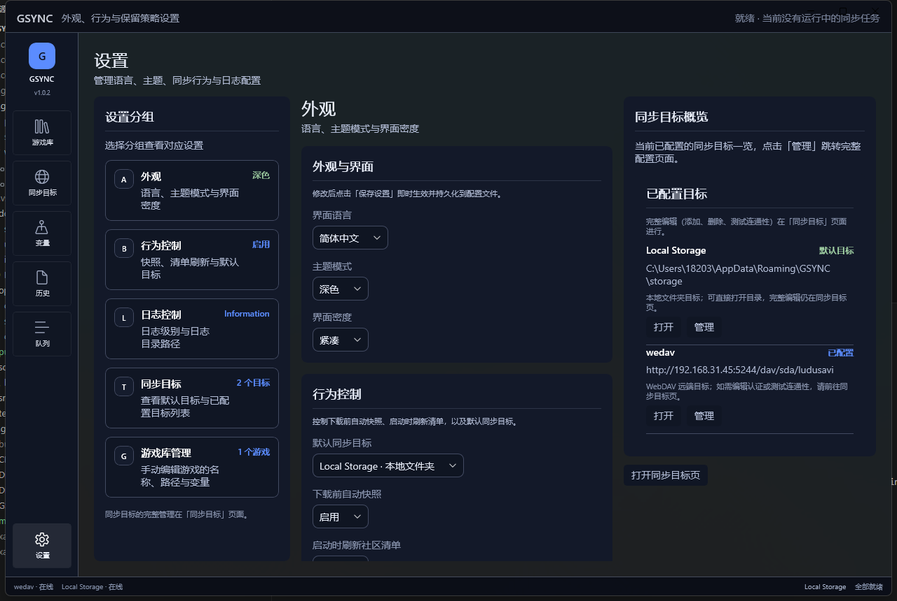
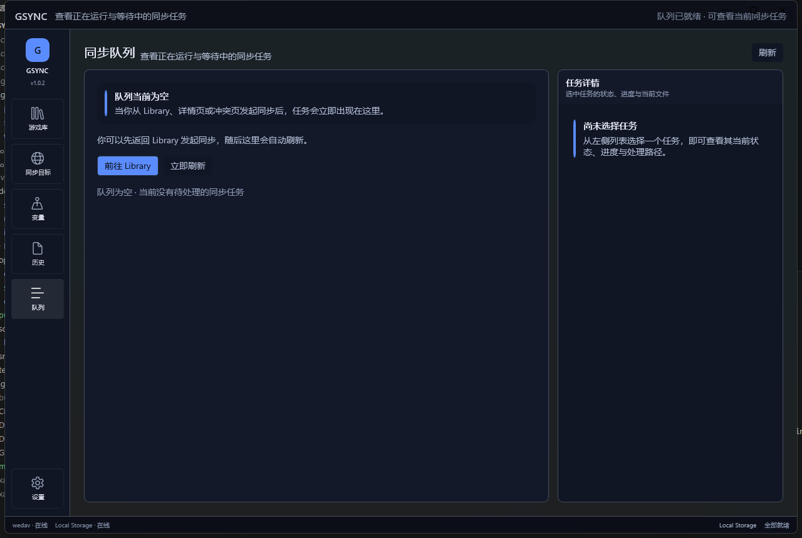
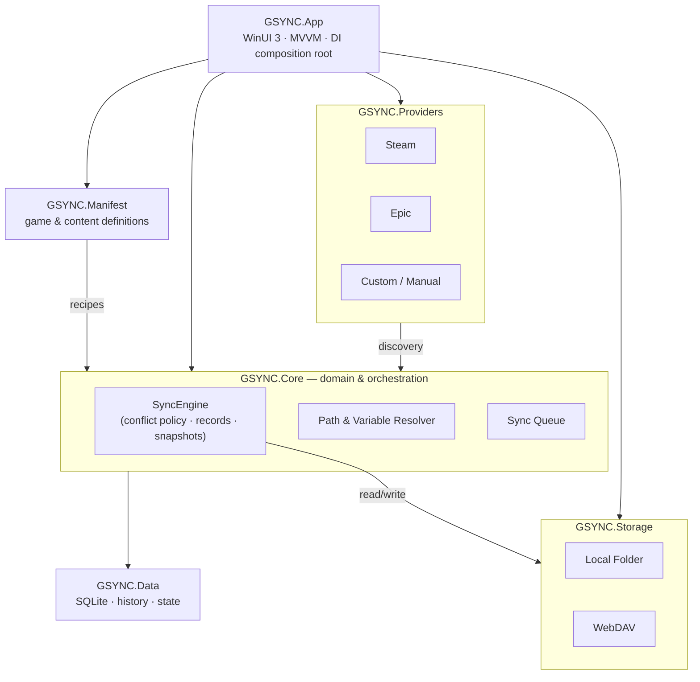

<div align="center">

# 🎮 GSYNC

### A modular, cross-device platform for synchronizing your game saves
### 模块化的跨设备游戏存档同步平台

[](https://dotnet.microsoft.com/)
[](https://learn.microsoft.com/windows/apps/winui/winui3/)
[](#-getting-started)
[](https://github.com/bennie-asi/gsync/actions/workflows/ci.yml)
[](#-architecture)
[](#-roadmap--status)

**English** · [简体中文](#-中文说明)

*Stop losing your progress. Keep every save, config and slot in sync across all your machines — safely.*
*别再丢档了。把每一份存档、配置和槽位在你所有设备间安全地同步。*



</div>

---

## ✨ Highlights

- 🗂️ **Multi-game library** — Track every game's local/remote sync status at a glance, with a live activity timeline.
- 🧩 **Content-item model** — A game isn't just one folder. Sync saves, character slots, user config and extra files independently.
- 🌐 **Pluggable storage targets** — Local folder and WebDAV today; OneDrive / Google Drive / SFTP / NAS by design.
- 🔌 **Source providers** — Discover installed games from **Steam**, **Epic**, or define them **manually**.
- 🧮 **Portable path variables** — Store logical templates like `%APPDATA%/MyGame/Saves` and resolve them per machine, with a built-in template tester.
- 🛟 **Safety-first conflicts** — Side-by-side comparison, backup-before-overwrite, and keep-both options. The **core engine** owns policy, not the storage layer.
- 🕓 **History & snapshots** — Every sync is recorded and auditable, with restore points to roll a save back in time.
- 🎨 **Native desktop feel** — A dense, utility-first WinUI 3 shell with split panes, property sheets and status bars — not a web dashboard.

> 中文说明见文末 [简体中文](#-中文说明)。

---

## 📸 Screenshots

| Library Dashboard | Game Details |
|:---:|:---:|
|  |  |
| **Sync Targets** | **Variables & Path Tester** |
|  |  |
| **History & Snapshots** | **Add Game Wizard** |
|  |  |
| **Settings** | **Sync Queue** |
|  |  |

---

## 🏗 Architecture

GSYNC is built around **strong module separation**. The four concerns below never bleed into each other — where a game comes from, what should be synced, where it's stored, and how the app looks are all independent.



**Key rule:** synchronization behavior lives in the **core sync engine**, never inside a storage provider. WebDAV doesn't decide conflict behavior; Google Drive won't decide snapshot behavior. Storage providers are responsible only for remote read/write.

> **关键原则：** 同步策略（冲突处理、记录、快照）只属于核心同步引擎，存储 Provider 只负责远端读写能力，绝不掺杂同步逻辑。

### Module layout

| Project | Responsibility |
|---|---|
| `src/GSYNC.App` | WinUI 3 shell, XAML pages, view models, DI composition root |
| `src/GSYNC.Core` | Domain models, abstractions, path/variable resolution, sync queue & `SyncEngine` |
| `src/GSYNC.Data` | SQLite persistence — app state, sync records, history |
| `src/GSYNC.Manifest` | Manifest loading/parsing for known games & content definitions |
| `src/GSYNC.Storage` | Storage providers — Local folder, WebDAV |
| `src/GSYNC.Providers` | Source providers — Steam, Epic, Custom discovery |

---

## 🧱 Tech Stack

| Area | Choice |
|---|---|
| Language / Runtime | C# 12 · .NET 8 (`net8.0-windows10.0.19041.0`, win-x64) |
| Desktop UI | WinUI 3 / Windows App SDK · MVVM (CommunityToolkit.Mvvm) |
| Persistence | SQLite (`Microsoft.Data.Sqlite`) |
| Manifests | YamlDotNet |
| Archive / snapshots | ZIP (`ICSharpCode.SharpZipLib`) |
| Logging | Serilog |
| Composition | `Microsoft.Extensions.DependencyInjection` |
| Tests | xUnit · coverlet |

---

## 🚀 Getting Started

### Prerequisites
- **Windows 10 (1904x) or later**, x64
- **.NET 8 SDK**
- Windows App SDK workload (restored automatically as a NuGet dependency)

### Build & run

```bash
# Restore solution packages
dotnet restore GSYNC.sln

# Build the desktop app
dotnet build src/GSYNC.App/GSYNC.App.csproj -p:Platform=x64

# Run it
dotnet run --project src/GSYNC.App/GSYNC.App.csproj -p:Platform=x64
```

### One-shot packaged build

`scripts/build.ps1` is the single source of truth for **restore → test → publish → zip** (used by both CI and release):

```powershell
scripts/build.ps1 -Version 0.0.0-local
```

### Tests

```bash
# Full suite
dotnet test GSYNC.sln --no-build

# A single project
dotnet test tests/GSYNC.Core.Tests/GSYNC.Core.Tests.csproj

# A single test
dotnet test tests/GSYNC.Core.Tests/GSYNC.Core.Tests.csproj \
  --filter "FullyQualifiedName~UploadJob_UploadsFiles_AndWritesSyncRecord"
```

---

## 📂 Project Structure

```text
gsync/
├─ src/
│  ├─ GSYNC.App/         # WinUI 3 desktop shell (Pages/, ViewModels/, Primitives/)
│  ├─ GSYNC.Core/        # Domain, abstractions, SyncEngine, path resolver
│  ├─ GSYNC.Data/        # SQLite repositories (state, history)
│  ├─ GSYNC.Manifest/    # Game & content manifest parsing
│  ├─ GSYNC.Storage/     # Local folder & WebDAV storage providers
│  └─ GSYNC.Providers/   # Steam / Epic / Custom source providers
├─ tests/                # xUnit suites per backend boundary
├─ docs/                 # Product, UI & design documentation
├─ scripts/build.ps1     # restore → test → publish → zip
└─ .github/workflows/    # CI (ci.yml) + release (release.yml)
```

See `docs/implementation-handoff.md` for the full product intent, domain model and architectural rationale.

---

## 🗺 Roadmap & Status

GSYNC is under **active development**. The desktop shell and all eight primary screens are implemented and runnable; the sync engine, storage providers and history pipeline are wired end-to-end.

- [x] App shell, navigation rail, themed dark UI
- [x] Library, Game Details, Sync Targets, Variables, History, Queue, Settings
- [x] 6-step Add Game wizard
- [x] Local folder + WebDAV storage providers
- [x] Steam / Epic / Custom source discovery
- [x] Path-variable resolution + template tester
- [x] Sync history & snapshot records
- [ ] Additional cloud targets (OneDrive / Google Drive / SFTP / NAS)
- [ ] Snapshot restore confirmation & richer conflict diagnostics
- [ ] Cross-platform desktop (macOS / Linux) — see product intent docs

---

## 🤝 Contributing

This is currently a personal project in heavy iteration. Issues and ideas are welcome via the [GitHub repo](https://github.com/bennie-asi/gsync). Please keep changes aligned with the module separation described above, and verify with `dotnet build` + the relevant `dotnet test` projects before opening a PR.

## 📄 License

No license has been declared yet. Until one is added, all rights are reserved by the author.

---

<a name="-中文说明"></a>

## 🀄 中文说明

[English](#-gsync) · **简体中文**

**GSYNC** 是一款**模块化的跨设备游戏存档同步平台**。它不只是一个 WebDAV 上传器——它把"游戏从哪来""要同步什么内容""数据存到哪""界面长什么样"这四件事彻底解耦，让你在多台设备之间安全、可追溯地保持每一份存档一致。

### ✨ 核心能力

- 🗂️ **多游戏库** —— 一眼掌握每个游戏的本地/远端同步状态，并附带实时活动时间线。
- 🧩 **内容项模型** —— 一个游戏不只是一个文件夹。存档、角色槽位、用户配置、附加文件都能独立同步。
- 🌐 **可插拔存储目标** —— 现已支持本地文件夹与 WebDAV，架构上预留 OneDrive / Google Drive / SFTP / NAS。
- 🔌 **来源 Provider** —— 从 **Steam**、**Epic** 自动发现已安装游戏，或**手动**定义任意游戏。
- 🧮 **可移植路径变量** —— 用 `%APPDATA%/MyGame/Saves` 这类逻辑模板存储路径，在每台机器上分别解析，并内置模板测试器。
- 🛟 **安全优先的冲突处理** —— 本地/远端并排对比、覆盖前先备份、保留双方。同步策略由**核心引擎**掌控，而非存储层。
- 🕓 **历史与快照** —— 每次同步都被记录、可审计，并提供恢复点，把存档回滚到过去某个状态。
- 🎨 **原生桌面质感** —— 高信息密度、工具优先的 WinUI 3 界面：分栏、属性面板、状态栏，而非网页式后台。

### 🏗 架构原则

GSYNC 围绕**强模块分离**构建。最重要的一条规则是：**同步行为（冲突、记录、快照）只属于核心同步引擎，存储 Provider 只负责远端读写能力。** 上方的 [Architecture](#-architecture) 图与模块表对中英文同样适用。

| 模块 | 职责 |
|---|---|
| `GSYNC.App` | WinUI 3 外壳、页面、视图模型、DI 组合根 |
| `GSYNC.Core` | 领域模型、抽象、路径/变量解析、同步队列与 `SyncEngine` |
| `GSYNC.Data` | SQLite 持久化（应用状态、同步记录、历史） |
| `GSYNC.Manifest` | 已知游戏与内容定义的清单解析 |
| `GSYNC.Storage` | 存储 Provider（本地文件夹、WebDAV） |
| `GSYNC.Providers` | 来源 Provider（Steam、Epic、自定义发现） |

### 🚀 快速开始

```bash
# 还原依赖
dotnet restore GSYNC.sln

# 构建桌面应用
dotnet build src/GSYNC.App/GSYNC.App.csproj -p:Platform=x64

# 运行
dotnet run --project src/GSYNC.App/GSYNC.App.csproj -p:Platform=x64

# 运行测试
dotnet test GSYNC.sln --no-build
```

> 环境要求：Windows 10（1904x）及以上、x64、.NET 8 SDK。完整产品意图与领域模型见 `docs/implementation-handoff.md`。

### 🗺 项目状态

桌面外壳与全部八个主要页面均已实现并可运行，同步引擎、存储 Provider 与历史链路已端到端打通。下一步聚焦更多云端目标、快照恢复确认流程，以及跨平台（macOS / Linux）方向。

---

<div align="center">

*Built with .NET 8 · WinUI 3 · 用 ❤️ 打造*

</div>
